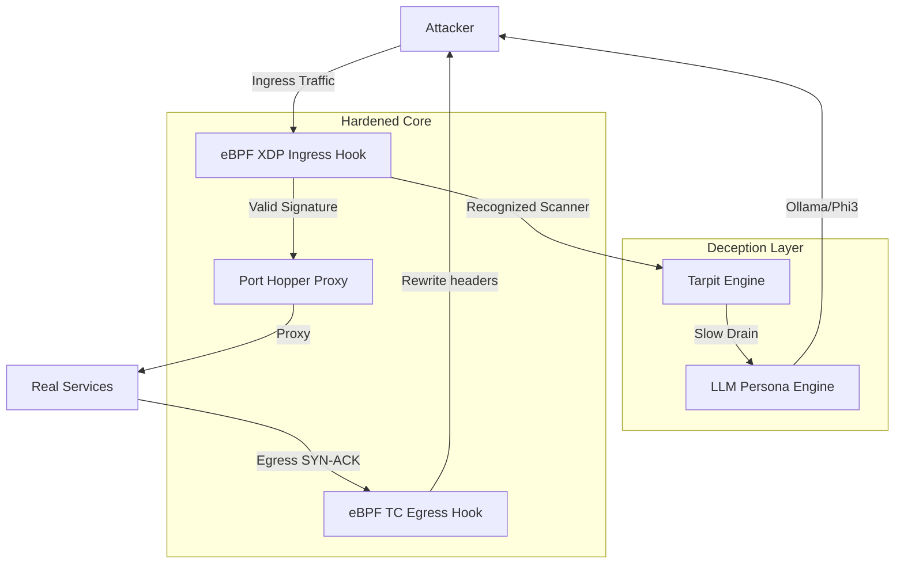

# Ghost-Protocol — your Linux server changes its identity every 60 seconds

[](https://github.com/0x7d4/Ghost-Protocol/actions)
[](https://github.com/0x7d4/Ghost-Protocol)
[](https://github.com/0x7d4/Ghost-Protocol/blob/main/LICENSE-APACHE)
[](https://www.rust-lang.org)

Ghost-Protocol turns your Linux server from a sitting duck into a glitch in the matrix. Today, if an attacker runs `nmap` against your IP, they see exactly what you're running: OpenSSH, Nginx, maybe a stray Redis port. With Ghost-Protocol, your real services are physically moved to a shifting, high-entropy port range derived from a TOTP secret, while every single one of the 65,535 standard ports is replaced by a deceptive tarpit. This tarpit doesn't just hang—it engages, using LLM-powered personas to mimic authentic service handshakes, wasting hours of automated and human reconnaissance while flagging the attacker at the kernel level.

## Architecture



## Quick Start

```bash
# 1. Clone the repository
git clone https://github.com/0x7d4/Ghost-Protocol.git && cd Ghost-Protocol

# 2. Build the full workspace
cargo build --release --workspace

# 3. Start the daemon (requires root for eBPF)
sudo ./target/release/ghostd --config ghostd.toml
```

First time? Run the setup script instead — it handles everything including TOTP secret generation and SSH config:
```bash
bash scripts/setup.sh
# With ollama LLM support:
bash scripts/setup.sh --with-ollama
```

## Generating Your TOTP Secret
The setup script generates and saves your secret automatically.
To generate one manually:
```bash
openssl rand -base32 20
```
> Save this secret — you need it on both your server 
> (ghostd.toml) and your client (~/.ssh/config). 
> Treat it like an SSH private key.

## SSH Connectivity
The setup script configures this automatically when you 
run `bash scripts/setup.sh`.

To configure manually, add to ~/.ssh/config:

```ssh
Host ghost-server
    HostName YOUR_SERVER_IP
    User YOUR_USERNAME
    ProxyCommand /path/to/ghost-knock %h 10000 1000 "YOUR_SECRET"
```

Then connect with: `ssh ghost-server`

## ghostd.toml Configuration Reference

| Field | Type | Default | Description |
| :--- | :--- | :--- | :--- |
| `interface` | `String` | `eth0` | Network interface for eBPF attachment. |
| `listen_addr` | `IpAddr` | `0.0.0.0` | Bind address for the port hopper. |
| `tarpit_enabled` | `Bool` | `true` | Enable the deceptive tarpit engine. |
| `ollama_url` | `String` | `http://localhost:11434` | Endpoint for LLM-powered responses. |
| `persona_dir` | `Path` | `./personas` | Directory containing persona `.toml` files. |
| `rotation_interval` | `U64` | `60` | Port rotation frequency in seconds. |

**Full `ghostd.toml` Example:**

```toml
# Network interface to attach eBPF programs to
interface = "eth0"

# Bind address for the port hopper
listen_addr = "0.0.0.0"

# Enable the deceptive tarpit engine
tarpit_enabled = true

# Ollama API endpoint for LLM-powered responses
ollama_url = "http://localhost:11434/api/chat"

# Directory containing persona .toml files
persona_dir = "./personas"

# Port rotation interval in seconds (must match ghost-knock client)
rotation_interval = 60
```

## Personas Reference

Ghost-Protocol uses `.toml` files in the `personas/` directory to define how it interacts with curious scanners.

- **ssh.toml**: Mimics an OpenSSH 7.4 server with realistic banner delays.
- **http.toml**: Serves a fake Apache 2.4.41 admin panel.
- **mysql.toml**: Implements the MySQL wire protocol for handshake deception.
- **smb.toml**: Mimics a Windows Server 2019 file sharing service.
- **generic.toml**: Low-latency confusion for unknown ports.

**Custom Persona Example:**
Create `personas/my-service.toml`:
```toml
system_prompt = "You are a bespoke industrial control system (SCADA). Respond with cryptic but valid-looking status codes."
static_fallback = "ERROR: SYSTEM_HALTED_0xDEADBEEF\r\n"
```

## How It Works

- **Layer 1: eBPF Morpher**: The TC egress hook rewrites outbound SYN-ACK TTL values, TCP window sizes, IP ID sequences, and TCP options (SACK, wscale, timestamps) to match a rotating OS persona — making your machine look like Linux, then Windows Server, then a Cisco router, cycling every 60 seconds.
- **Layer 2: Port Hopper**: A high-performance proxy that listens on a 1,000-port range. It uses a TOTP (Time-based One-Time Password) algorithm to determine which specific port is "open" this minute. All others lead to the tarpit.
- **Layer 3: Tarpit**: Employs a kernel-level flagging system. Once an IP hits a closed port, it is added to the `SCANNER_MAP`. All subsequent traffic from that IP is intercepted by the tarpit engine for slow-drain engagement.
- **Layer 4: LLM Persona Engine**: Integrates with Ollama to stream realistic terminal/protocol output. If the LLM is offline, it gracefully falls back to static honeypot banners to maintain the illusion.

## Requirements

| Requirement | Version | Notes |
|---|---|---|
| Linux kernel | 5.15+ | Required for XDP/TC eBPF hooks |
| CAP_NET_ADMIN + CAP_BPF | — | Required to load eBPF programs |
| Rust stable | 1.80+ | Workspace compilation |
| Rust nightly | latest | ghost-ebpf BPF target only |
| ollama + phi3:mini | optional | LLM persona engine |

### One-Command Setup (Ubuntu 22.04+)

```bash
# Installs deps, generates TOTP secret, configures SSH, 
# and runs cargo check + clippy + test
bash scripts/setup.sh

# Also installs ollama + phi3:mini:
bash scripts/setup.sh --with-ollama
```

The setup script handles everything: system packages, Rust stable + nightly, bpf-linker, and optionally ollama + phi3:mini.


## ⚠️ Before You Start — Allowlist Your IP

**This is the most important step.** If you start `ghostd` without allowlisting your own IP, you will be locked out of your server.

Add your admin IP to `ghostd.toml` before starting:

```toml
[allowlist]
ips = ["YOUR.ADMIN.IP.HERE/32", "192.168.1.0/24"]
```

To find your current public IP:

```bash
curl -s ifconfig.me
```

Allowlisted IPs bypass all eBPF hooks entirely — your SSH, monitoring, and CI/CD work exactly as before.

---

## Running as a Systemd Service

For production servers, run `ghostd` as a systemd service so it survives reboots.

Create `/etc/systemd/system/ghostd.service`:

```ini
[Unit]
Description=Ghost-Protocol Moving Target Defense Daemon
After=network.target
Wants=network-online.target

[Service]
Type=simple
ExecStart=/usr/local/bin/ghostd --config /etc/ghost-protocol/ghostd.toml
ExecStop=/usr/local/bin/ghostd --detach
Restart=on-failure
RestartSec=5s
# Required capabilities for eBPF
AmbientCapabilities=CAP_NET_ADMIN CAP_BPF CAP_NET_RAW
CapabilityBoundingSet=CAP_NET_ADMIN CAP_BPF CAP_NET_RAW
# Security hardening
NoNewPrivileges=yes
ProtectSystem=strict
ProtectHome=yes
ReadWritePaths=/var/log/ghost-protocol /run/ghost-protocol

[Install]
WantedBy=multi-user.target
```

Enable and start:

```bash
sudo cp target/release/ghostd /usr/local/bin/
sudo mkdir -p /etc/ghost-protocol
sudo cp ghostd.toml /etc/ghost-protocol/
sudo systemctl daemon-reload
sudo systemctl enable ghostd
sudo systemctl start ghostd
sudo systemctl status ghostd
```

---

## What Normal Operation Looks Like

**Startup:**

```
[2026-04-19T10:23:01Z INFO  ghostd] Ghost-Protocol starting
[2026-04-19T10:23:01Z INFO  ghostd::ebpf_loader] Attaching XDP hook to eth0
[2026-04-19T10:23:01Z INFO  ghostd::ebpf_loader] Attaching TC egress hook to eth0
[2026-04-19T10:23:01Z INFO  ghostd::ebpf_loader] Active persona: Linux 5.x (TTL=64, win=29200)
[2026-04-19T10:23:01Z INFO  ghostd::tarpit] Tarpit listening on 0.0.0.0:2222
[2026-04-19T10:23:01Z INFO  ghostd] Ghost-Protocol running. Press Ctrl+C to stop.
```

**Scanner engagement:**

```
[2026-04-19T10:31:14Z WARN  ghostd::ebpf_loader] Scanner detected: 45.33.32.156 (16 ports in 3s)
[2026-04-19T10:31:15Z INFO  ghostd::tarpit] Engaging 45.33.32.156 with persona: SSH-2.0-OpenSSH_7.4
[2026-04-19T10:31:15Z INFO  ghostd::persona] Streaming LLM response to 45.33.32.156:54821
[2026-04-19T10:40:02Z INFO  ghostd::session] Session closed: {
  "src_ip": "45.33.32.156",
  "duration_secs": 523,
  "credential_tries": 7,
  "bytes_wasted": 4821,
  "tool_signature": "Nmap",
  "score": 1081,
  "summary": "Confused Nmap for 8m 43s — 4821 bytes wasted, 7 cred attempts"
}
```

---

## Stopping and Detaching eBPF Programs

```bash
# If running as a systemd service
sudo systemctl stop ghostd

# If running manually — Ctrl+C triggers a clean detach automatically.

# Force-detach eBPF hooks without the daemon running:
sudo ./target/release/ghostd --detach
```

> ⚠️ **Never `kill -9` the process.** This leaves eBPF programs pinned to the interface until the next reboot, affecting all traffic on that NIC.

---

## Tested Environments

| Distribution | Kernel | Status |
| :--- | :--- | :--- |
| Ubuntu 22.04 LTS | 5.15 | ✅ Tested |
| Ubuntu 24.04 LTS | 6.8 | ✅ Tested |
| Debian 12 | 6.1 | ✅ Tested |
| Fedora 38 | 6.2 | ✅ Tested |
| WSL2 (Ubuntu) | 5.15 | 🛠 Dev only — no eBPF |

---

## Testing

The workspace includes a rigorous suite of integration and unit tests.

```bash
# Run the full suite sequentially
cargo test --workspace -- --test-threads=1
```

- **26 Non-Privileged Tests**: Coverage for UI, proxy logic, and session tracking.
- **1 Privileged Test**: `ebpf_test.rs` requires root and `CAP_NET_ADMIN` to create virtual veth pairs for testing the data plane.

## License

This project is licensed under either of:
- Apache License, Version 2.0 ([LICENSE-APACHE](LICENSE-APACHE) or http://www.apache.org/licenses/LICENSE-2.0)
- MIT license ([LICENSE-MIT](LICENSE-MIT) or http://opensource.org/licenses/MIT)

## Contributing

1. **Fork** the repository at [github.com/0x7d4/Ghost-Protocol](https://github.com/0x7d4/Ghost-Protocol)
2. **Create a feature branch**: `git checkout -b feature/my-improvement`
3. **Run the test suite** before submitting: `cargo test --workspace -- --test-threads=1`
4. **Open a Pull Request** with a clear description of your change

All contributions must pass `cargo clippy -- -D warnings` and `cargo fmt --check` before review.
